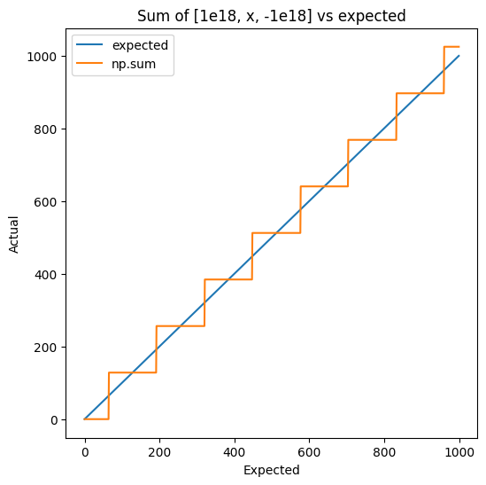

# Introduction

FRECKLL (**F**ull and **R**educed **E**xoplanet **C**hemical **K**inetics Disti**LL**ed) is a Python
Chemical Kinetic Solver for Exoplanetary atompsheres. The code attempts to solve the equation:

$$
\frac{\partial n_i}{\partial t} = P_i -L_i - \frac{\partial \phi_i}{\partial z}
$$

where $n_i$, $P_i$ and $L_i$ are the number density, production rate and loss rate of species $i$, $z$ is the vertical coordinate of the atmosphere, and $\phi_i$ is the vertical flux for species $i$ which has the form of a diffusion equation given below

$$
\phi_i = -n_i D_i \left( \frac{1}{n_i}\frac{\partial n_i}{\partial z} + \frac{1}{H_i} + \frac{1}{T}\frac{\partial T}{\partial z}\right) - n_i K_{zz}\left(\frac{1}{y_i}\frac{\partial y_i}{\partial z}\right)
$$

Here, $D_i$ is the molecular diffusion coefficient, $H_i$ is the scale height and $y_i$ the mixing ratio for species $i$, T is the temperature (K) and $K_{zz}$ is the eddy diffusion coefficient.

## Distillation

So what is FRECKLL doing differently? Its best to explain which an example. What is the output of this code?

```python
sum([1e16, 1, -1e16])
```

This should be easy enough. Let see what python says:

```python
>>> sum([1e16, 1, -1e16])
0.0
```

Wait a minute... this should be one. what is going on? Well this example hits the limit of floating point numbers.
First `1e16 + 1` since the magnitude differece is so large, the 1 is lost. Then `1e16 - 1e16` is zero. So the result is zero. This is called **catastrophic cancellation**.
For our case, reaction rates often have these type of magnitude differences. Not handling this properly can lead to discontinuous function which is not good for numerical solvers.



This is where FRECKLL comes in. It uses a _K-sum_, _distillation_ method to avoid this problem:

```python
>>> from freckll.distill import ksum
>>> data = np.array([1e16, 1, -1e16])
>>> ksum(data)
np.float64(1.0)
```

Smooth Jacobians! Perfect for solving.


